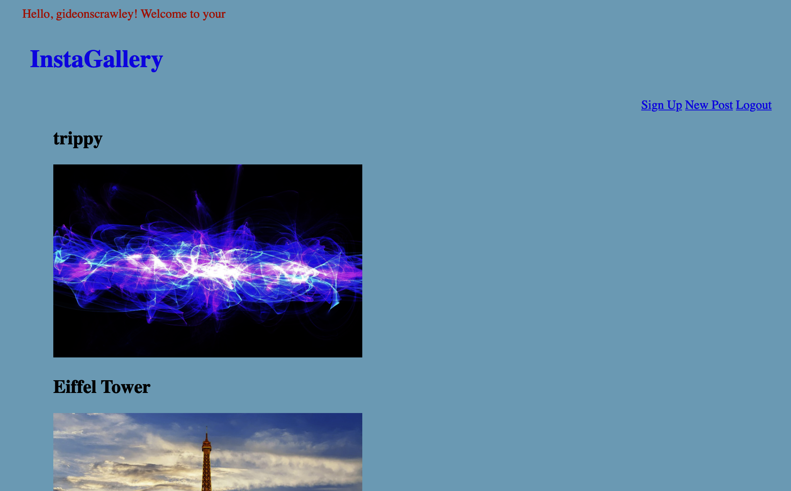

# django_photo_upload

## i built this project from scratch using Django.  It's a rudimentary Instagram photo gallery clone with functional user authorization, meaning you can sign up, log in, and upload photos to be displayed on the site. 

## I attempted to push this project live to Heroku, and unfortunately WhiteNoise does not support Django projects that include Media Files. I then looked into pushing it live to Github Pages but apparently it does not support Django. 

## in order to run the project, clone my repo, make sure you're in the "insta" root folder, and use python3 manage.py runserver.

## I will update this repo if find a way to make the application live.

